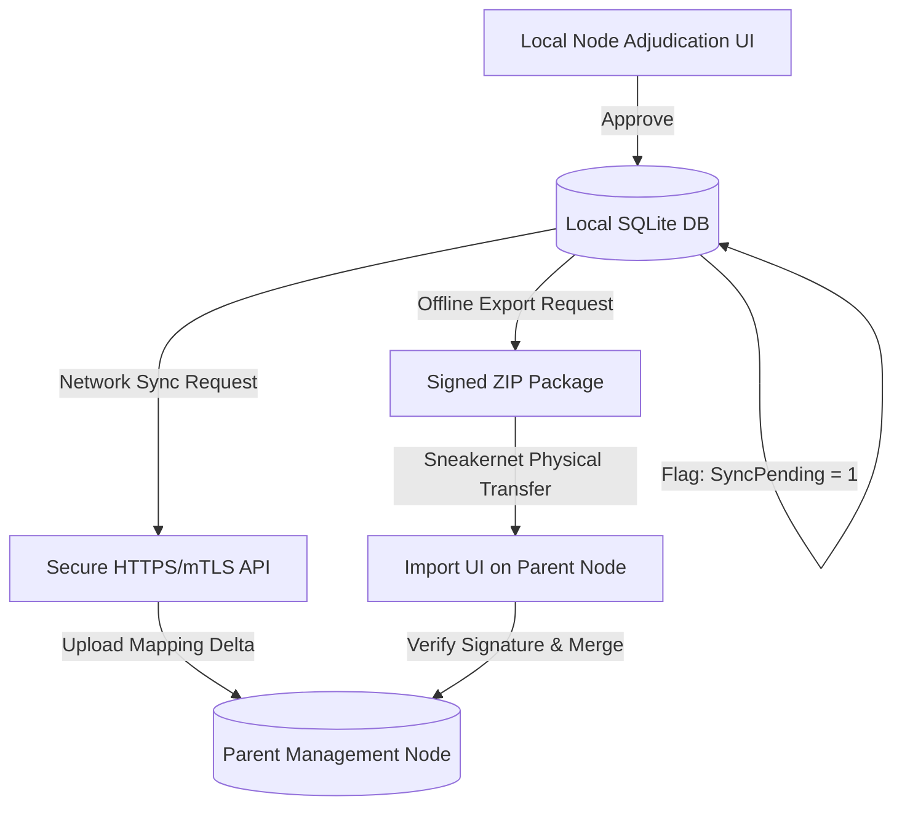

# Static Mapping, Adjudication Sync & ML Pipelines Design Specification

This document details the architectural design and database schemas supporting AutoRMF's transition to a **static, pre-computed compliance mapping database** and defines the six new data ingestion and Machine Learning (ML) pipelines.

---

## 1. Static Mapping Architecture & Database Schema

Instead of relying solely on real-time, on-demand local fuzzy matching during scan ingestion, AutoRMF utilizes a pre-computed database of mappings. The database holds static records mapping CVEs and STIG rule IDs to compliance controls.

### 1.1 Database Schema Extensions
We define three states of mappings:
1. **System Mappings (Locked):** Verified, high-confidence mappings delivered via official seed updates. Cannot be overridden except by system updates.
2. **User Mappings (Adjudicated):** Custom mappings created or approved by auditors.
3. **Proposed Mappings (Confidence-Based):** Mappings generated by search fallbacks or ML engines that are pending user review.

We introduce the following database schema (relational representation for SQLite/PostgreSQL):

```sql
-- Represents NIST/CMMC controls catalog
CREATE TABLE NistControls (
    ControlId VARCHAR(50) PRIMARY KEY,
    Family VARCHAR(100) NOT NULL,
    Title VARCHAR(255) NOT NULL,
    Description TEXT NOT NULL
);

-- Pre-computed or manual mappings index
CREATE TABLE PreComputedMappings (
    MappingId GUID PRIMARY KEY,
    SourceId VARCHAR(100) NOT NULL,          -- e.g. "CVE-2022-3821" or "STIG-V-251234"
    SourceType VARCHAR(20) NOT NULL,        -- 'CVE' or 'STIG'
    ControlId VARCHAR(50) NOT NULL,          -- Foreign key to NistControls
    ConfidenceScore DECIMAL(5,2) NOT NULL,  -- e.g. 100.00 for locked, 0.00-99.99 for proposed
    MappingType VARCHAR(20) NOT NULL,       -- 'LOCKED', 'USER_APPROVED', 'PROPOSED'
    AdjudicatorComments TEXT,
    UpdatedAt TIMESTAMP WITH TIME ZONE DEFAULT CURRENT_TIMESTAMP,
    FOREIGN KEY (ControlId) REFERENCES NistControls(ControlId)
);

CREATE INDEX idx_mappings_source ON PreComputedMappings(SourceId);
```

### 1.2 Interactive User Adjudication Workflow
When a vulnerability scanner finding is ingested:
1. The engine checks `PreComputedMappings` for `SourceId` (CVE or plugin/rule identifier).
2. If a `LOCKED` or `USER_APPROVED` mapping exists, it is automatically applied to the finding.
3. If only `PROPOSED` mappings exist (or no mapping is found), the finding is placed in the **Pending Adjudication** queue.

The Portal UI displays the following context side-by-side to assist the auditor:

```
+-----------------------------------------------------------------------------------+
|                           Compliance Adjudication Panel                           |
+-----------------------------------------------------------------------------------+
| FINDING DETAILS:                                                                  |
| Title: CVE-2015-1635: Microsoft IIS Remote Code Execution (HTTP.sys)              |
| CVE Summary: Vulnerability in HTTP.sys in Microsoft IIS allows remote attackers   |
|              to execute arbitrary code via specially crafted HTTP requests.       |
+-----------------------------------------------------------------------------------+
| PROPOSED MAPPINGS:                                                                |
|                                                                                   |
| [ ] SI-2 (Flaw Remediation) [Confidence: 89.2%]                                   |
|     Control Text: The organization identifies, reports, and corrects system       |
|     flaws; installs security-relevant software updates...                         |
|                                                                                   |
| [ ] SC-7 (Boundary Protection) [Confidence: 45.1%]                                |
|     Control Text: The information system monitors and controls communications     |
|     at the external boundary of the system...                                     |
|                                                                                   |
| [ ] Custom Control ID: [ ________ ]                                               |
+-----------------------------------------------------------------------------------+
| Comments: [ Patched on domain controllers via KB3042553.                        ] |
|                                                                                   |
|                                  [ Approve Selection ]                            |
+-----------------------------------------------------------------------------------+
```

Upon clicking **Approve Selection**, the status in `PreComputedMappings` is updated to `USER_APPROVED` (confidence score set to `100.00`), and it is flagged for synchronization.

---

## 2. Synchronization & Rollup Protocols

Adjudications confirmed on a local node must propagate to parent management nodes. To prevent uncontrolled traffic, updates are never pushed automatically; they are queued and synchronized **on-request** or exported manually.



### 2.1 Networked Sync Protocol (On-Request)
If the local machine is connected and configuration allows, clicking "Sync to Parent" triggers a mutual TLS (mTLS) authenticated POST request to the parent's API:

* **Endpoint:** `POST /api/fleet/sync-adjudications`
* **Payload:**
```json
{
  "nodeId": "tactical-node-03",
  "timestamp": "2026-07-09T16:26:47Z",
  "updates": [
    {
      "sourceId": "CVE-2015-1635",
      "controlId": "SI-2",
      "comments": "Manually confirmed: HTTP.sys vulnerability maps directly to Flaw Remediation.",
      "adjudicator": "auditor@tactical.mda.mil",
      "signature": "MEQCIFz/..."
    }
  ]
}
```

### 2.2 Sneakernet Sync Protocol (Offline Package)
In air-gapped environments:
1. The user clicks **Export Compliance Package** from the local portal.
2. The [EgressService](file:///c:/repos/AutoRMF/src/AutoRMF.Engine/Services/EgressService.cs) packages the system state. It includes the `PreComputedMappings` where `MappingType = 'USER_APPROVED'`.
3. The package is zipped and cryptographically signed using the node's private RSA key.
4. When imported into the parent management node via the portal's upload interface, the parent verifies the signature, unpacks the SQLite delta, and upserts the findings into its central database.

---

## 3. Data & ML Pipelines (New Tasks / Projects)

To sustain the static mapping database and keep it accurate, we define six new tasks and pipelines:

### Task 1: Nightly cvelistV5 Git Sync
* **Objective:** Maintain an up-to-date catalog of all CVEs.
* **Mechanism:** A scheduled worker script clones the [CVEProject/cvelistV5](https://github.com/CVEProject/cvelistV5) repository. Every night, it performs a `git pull` or fetches delta releases (zips) containing newly added or modified CVE JSON records.
* **Output:** A local directory containing structured JSON records of the entire CVE catalog.

### Task 2: Daily CVE Database Ingestion
* **Objective:** Parse newly updated CVEs and update the local database.
* **Mechanism:** An ingestion service monitors the Git repository changes, parses modified CVE JSON files, and populates the `CveMetadata` table. If a CVE includes standard mapping tags (such as CWEs or CAPEC references) that have known concrete mappings to NIST controls, these are resolved and written as `LOCKED` mappings.

### Task 3: RAG Compliance Mapping Library
* **Objective:** Map unknown CVEs to likely compliance controls using Retrieval-Augmented Generation (RAG).
* **Mechanism:**
  1. Build a local vector store containing the full text of NIST SP 800-53 (and CMMC) controls.
  2. For any newly ingested CVE without a concrete mapping, query the vector store using the CVE summary description.
  3. Retrieve the top 3-5 most similar controls.
  4. Format these controls alongside the CVE details as context, and query a local LLM to propose mappings with computed confidence scores based on text overlap and semantic similarity.
  5. Store results in `PreComputedMappings` as `PROPOSED`.

### 3.1 Embedding Model Reference & Swap Guidelines
AutoRMF is designed to support plug-and-play offline embedding models. The mapping quality is directly correlated to the model's retrieval benchmark on the Massive Text Embedding Benchmark (MTEB).

#### Target Model Configuration Setup

##### 1. Local Workstation: `bge-large-en-v1.5` (F32 Unquantized)
- **Role:** High-precision local baseline.
- **Dimension Size:** 1024 (requires configuring FAISS indexing with `dimension = 1024`).
- **Context Length:** 512 tokens (the maximum supported context limit for the BGE family, ample for standard CVE summaries).
- **Footprint:** ~1.34 GB. Fits entirely inside local GPU VRAM.

##### 2. Remote Inference Machine: `gte-Qwen2-7B-instruct` (F16/F32 Unquantized)
- **Role:** High-capacity LLM-based embedding model running on your remote 128GB Unified Memory machine.
- **Dimension Size:** 3584 (requires configuring FAISS indexing with `dimension = 3584`).
- **Context Length:** 8192 tokens (default context length, providing extensive capacity for complex policy texts and multi-paragraph CVE reports).
- **Footprint:** ~14.2 GB.

#### Golden Dataset Validation Separation
To maintain consistency during database updates or full re-imports, the validation golden dataset is stored externally in [golden_validation_set.json](file:///c:/repos/AutoRMF/docs/scripts/golden_validation_set.json).
* **Benefit:** When reloading or re-seeding the main CVE database (`CveMetadatas` table), the validated test suite remains decoupled and is not overwritten, allowing you to consistently measure mapping precision, recall, and MRR.

#### Alternative/Future Models (Interchangeable)
If system resources change or newer models are released, they can be swapped by updating the `INFERENCE_URL` configuration in the RAG scripts and adjusting the vector space dimension size:

1. **`nomic-embed-text-v1.5` (Matryoshka-enabled)**
   - *MTEB Retrieval:* High (56.0)
   - *Dimension Size:* 768 (Supports trimming down to 256 or 512 using Matryoshka learning).
   - *Context Length:* 8192 tokens.
   - *File Size:* ~280 MB.
2. **`snowflake-arctic-embed-m-v1.5`**
   - *MTEB Retrieval:* Very High (62.5)
   - *Dimension Size:* 768
   - *Context Length:* 512 tokens.
   - *File Size:* ~430 MB.

#### Model Swap Checkpoints
To swap embedding models in the future:
1. Load the new GGUF embedding model inside LM Studio.
2. Update the `dimension` variable in the Python RAG mapper script (`offline_rag_mapper.py`) to match the new model's dimensions (e.g., changing from `1024` for BGE to `768` for Nomic).
3. Re-run the embeddings generation script to rebuild the local FAISS index (`vectors_np`).

For detailed instructions on exporting fine-tuned Hugging Face weights, merging LoRA adapters, and converting them to GGUF, see the [Model Export & GGUF Conversion Guide](file:///c:/repos/AutoRMF/docs/12_model_conversion_guide.md).

#### Evaluation Baseline Benchmarks (Initial Runs)
Prior to fine-tuning, the initial zero-shot validation benchmarks for the candidate embedding models are recorded below against the [golden_validation_set.json](file:///c:/repos/AutoRMF/docs/scripts/golden_validation_set.json) (2,000 items):

| Model / Metric | Strict Hit Rate @ 1 | Strict Hit Rate @ 3 | Strict MRR | Parent Roll-up HR @ 1 | Parent Roll-up HR @ 3 | Parent Roll-up MRR |
|---|---|---|---|---|---|---|
| **`text-embedding-gte-qwen2-7b-instruct`** (Zero-shot Initial Run) | 0.1% | 0.4% | 0.003 | 0.4% | 1.1% | 0.007 |
| **`text-embedding-bge-large-en-v1.5`** (Zero-shot Initial Run) | 0.3% | 0.9% | 0.005 | 8.4% | 18.6% | 0.127 |
| **`bge-base-en-v1.5`** (Fine-Tuned Run) | **77.5%** | **82.2%** | **0.795** | **82.0%** | **87.2%** | **0.842** |

#### Reranking & Hybrid Search Experimental Benchmarks (Cycle 1)
To test secondary retrieval optimization techniques, we ran evaluation passes using the fine-tuned model as the first-stage retriever combined with a downstream LLM reranker.

##### Remote LLM Reranking (Qwen2.5-7B-Instruct)
* **Retriever:** `bge-base-en-v1.5-fine-tuned` (Top 10 candidates)
* **Reranker:** `qwen2.5-7b-instruct` (Served via LM Studio API, temperature = 0.0)
* **Sample Size:** 100 validation samples

| Metric Group | Strict Hit Rate @ 1 | Strict Hit Rate @ 3 | Strict MRR | Parent Roll-up HR @ 1 | Parent Roll-up HR @ 3 | Parent Roll-up MRR |
|---|---|---|---|---|---|---|
| **Raw Fine-Tuned BGE-Base** | **77.5%** | **82.2%** | **0.795** | **82.0%** | **87.2%** | **0.842** |
| **BGE-Base + Qwen2.5 Rerank** | 72.0% | 80.0% | 0.760 | 82.0% | 86.0% | 0.840 |

* **Observation:** The general-purpose Qwen2.5-7B LLM actually introduced slight noise on the top-10 candidate pool compared to the pure fine-tuned embedding model (Strict HR@1 dropped from 77.5% to 72.0%). This demonstrates that a specialized, domain-tuned contrastive embedder can outperform general LLM reasoning for strict compliance matching.

##### Hybrid Search (Dense Fine-Tuned BGE + Sparse BM25)
* **Dense Model:** `bge-base-en-v1.5-fine-tuned` (Top 50 candidates)
* **Sparse Index:** BM25 Okapi (Top 50 candidates)
* **Fusion Rule:** Reciprocal Rank Fusion (RRF, $k=60$)
* **Sample Size:** 2,000 validation samples

| Metric Group | Strict Hit Rate @ 1 | Strict Hit Rate @ 3 | Strict MRR | Parent Roll-up HR @ 1 | Parent Roll-up HR @ 3 | Parent Roll-up MRR |
|---|---|---|---|---|---|---|
| **Raw Fine-Tuned BGE-Base** | **77.5%** | **82.2%** | **0.795** | **82.0%** | **87.2%** | **0.842** |
| **BGE-Base + BM25 Hybrid** | 13.7% | 58.1% | 0.331 | 22.0% | 66.3% | 0.416 |

* **Observation:** Hybrid Search severely degraded retrieval performance (Strict HR@1 plummeted to 13.7%). This is because:
  1. **Vocabulary Mismatch:** CVE descriptions (which discuss technical concepts like *buffer overflow*, *race conditions*, *heap corruption*) share almost zero exact keywords with CMMC control texts (which discuss administrative controls like *input validation*, *memory protection*, *software lifecycle*).
  2. **RRF Poisoning:** Because BM25 keyword matching returns highly noisy results for cross-domain queries, fusing the sparse rankings with the dense rankings diluted the high-precision dense matches, pushing the true target control way down the final rank.
  3. **Decision:** Pure dense retrieval (fine-tuned) is the optimal architecture for CVE-to-Control mapping. Hybrid search using exact keyword match (BM25) should not be used.


### Task 4: Evaluation & Model Re-Tuning Pipeline
* **Objective:** Automatically retrain the mapping model and test its performance.
* **Mechanism:**
  1. A schedulable pipeline is triggered when the volume of user-approved mappings exceeds a set threshold.
  2. The system splits the manually approved (`USER_APPROVED`) and system-locked (`LOCKED`) mappings into a training set and a validation test set.
  3. The model is fine-tuned on the training set.
  4. The validation suite tests the updated model against the validation set, calculating precision, recall, and F1-score.
  5. The model is only promoted if validation scores meet or exceed baseline thresholds.

For a detailed analysis of the mathematical and architectural safeguards used to prevent over-tuning, see the [Model Retraining & Overfitting Safeguards Specification](file:///c:/repos/AutoRMF/docs/13_model_retraining_and_overfitting_safeguards.md).

### Task 5: Mapping Distinction and Priority Rules
* **Objective:** Prevent machine learning models from overwriting human decisions.
* **Mechanism:**
  * Strict precedence rules are enforced at the database level and API layer:
    1. **USER_APPROVED:** User mappings take highest priority and cannot be modified by the system.
    2. **LOCKED:** Official deterministic mappings are system-locked and cannot be modified by ML models.
    3. **PROPOSED:** Confidence-based mappings from RAG/LLM can be overwritten by newer model runs until a user approves or rejects them.

### Task 6: Model Lifecycle & Scheduled Retraining Manager
* **Objective:** Automate the end-to-end model training lifecycle.
* **Mechanism:** A background daemon service handles the scheduling, training compute allocations, versioning of weights, and rolling deployments of the local classifier model.

---

## 4. Framework Extensibility
While initially targeting NIST SP 800-53 Rev. 5, the static mapping schema is extensible. Mappings are keyed against control identifiers. By registering separate control catalog tables (e.g. `CmmcPractices` or `Iso27001Controls`) and joining them via a polymorphic mapping table, the same RAG pipeline and user interfaces can map vulnerabilities to multiple compliance frameworks simultaneously.

---

## 5. Architectural Separation of Datastores

To maintain high data integrity, facilitate clean compliance audits, and prevent high-frequency write noise from impacting official RMF records, AutoRMF separates its datastores into two independent files/instances:

### 5.1 Compliance Evaluation Database (`autormf.db`)
* **Purpose:** Core RMF state, control catalog metadata, scan findings, and manually adjudicated mappings.
* **Write Frequency:** Low (primarily during batch report uploads, manual adjudications, or scheduled pipeline runs).
* **Audit Value:** High. This contains the official compliance ledger and authorized variances.
* **Tables:** `NistControls`, `PreComputedMappings`, `ScanFindings`, `ControlMappings`, `CveMetadata`, `CweControlMaps`.

### 5.2 Telemetry Drift Database (`autormf_telemetry.db`)
* **Purpose:** Real-time event logging capturing system modifications (Windows ETW, Linux eBPF/auditd events).
* **Write Frequency:** High (captures every registry, GPO, or system file change as they occur in real time).
* **Audit Value:** Operational/Transient. It serves to identify local drift and alert administrators to run re-tests, but does not represent the official systems authorization state.
* **Tables:** `TelemetryDriftEvents`, `LocalAuditLogs`, `ServiceHeartbeats`.

---

## 6. Database Maintenance & Operations (CLI)

To comply with database auditability requirements, core lookup catalog modifications (such as seeding controls or ingesting CVE feeds) are separated from the running ASP.NET Web Engine. These tasks must be initiated manually or via scheduled OS tasks using the Telemetry Console CLI.

### 6.1 Database Seeding (NIST & CWE Catalogs)
To manually seed or completely refresh the NIST SP 800-53 Rev. 5 controls catalog (1,196 parent controls + enhancements) and the CWE-to-NIST mappings, execute:

```powershell
dotnet run --project AutoRMF.Telemetry.Console --framework net10.0 -- --seed-db
```

* **Under the Hood:**
  * Checks the database count of `NistControls`. If less than 1,000, it performs a full wipe and re-seed.
  * Disables foreign key checks during deletion (`PRAGMA foreign_keys = OFF;`) to prevent constraint violations from dependent tables.
  * Recursively extracts parent base controls and nested control enhancements from `nist_seed.json` and standardizes identifiers into standard labels (e.g. `AC-2(1)` instead of `ac-2.1`).

### 6.2 Offline CVE Ingestion & Sync Pipeline
To sync the local CVE list and import/update records in the database, run the automation script:

```powershell
.\docs\scripts\pull_cves.ps1
```

* **Incremental/Delta Updates:**
  * **First Run:** If the repository marker file (`.import_done`) is missing, a full recursive scan of the cloned git repository is performed, importing all 220,000+ CVE records.
  * **Incremental Runs:** On subsequent updates, the script executes `git pull` and uses `git diff` to extract only the changed/added JSON files. It writes these files to `changed_files.txt` and executes the importer with `--file-list changed_files.txt`, updating only the modified records.
  * **Deduplication Check:** The importer pre-caches existing database CVE IDs into an in-memory `HashSet<string>`, eliminating N+1 SELECT queries.
  * **Memory Optimization:** Clears Entity Framework's change tracker (`ChangeTracker.Clear()`) after every batch to prevent memory leaks.
  * **Force Override:** Run with `-Force` to force a full re-import regardless of Git diff or marker files:
    ```powershell
    .\docs\scripts\pull_cves.ps1 -Force
    ```


