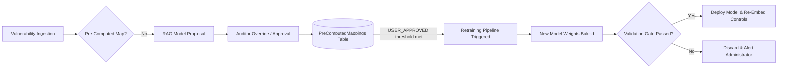

# Model Retraining & Overfitting Safeguards Specification

This document details the design of AutoRMF’s continuous learning feedback loop, the risks of model over-tuning (overfitting and catastrophic forgetting), and the cryptographic and mathematical safeguards implemented to guarantee mapping precision over time. 

This specification serves as a reference for Phase II proposals and system authorization audits.

---

## 1. The Continuous Learning Feedback Loop

As AutoRMF is deployed in production environments, the volume of vulnerability data and manual auditor mapping overrides grows. To capture this operational knowledge, the system implements a cyclic retraining pipeline:



### 1.1 Ingestion of Custom Auditor Knowledge
Every time an auditor reviews a proposed control mapping and clicks **Approve** or **Override**, the action is committed to the database:
* **Record Type:** Saved in the `PreComputedMappings` table with the type `USER_APPROVED`.
* **Data Value:** A high-fidelity, human-verified positive training pair: `[Vulnerability Description, Correct NIST Control]`.
* **Retraining Trigger:** A background service monitors the count of `USER_APPROVED` records. Once a configured threshold is crossed (e.g., 100 new unique manual adjudications), it schedules a retraining run.

---

## 2. The Over-Tuning & Regression Risks

Fine-tuning pre-trained language and embedding models on a small, local dataset introduces two significant machine learning risks:

1. **Overfitting (Over-Tuning):** The model memorizes the exact phrasing of the custom CVEs it was trained on. Consequently, it loses the ability to generalize, making poor recommendations for future, unseen vulnerability descriptions.
2. **Catastrophic Forgetting:** The model adjusts its weights so heavily to fit the new local compliance examples that it forgets its general English language comprehension and baseline security terminology.

---

## 3. Implemented Safeguards & Mitigation Strategies

To eliminate these risks, AutoRMF incorporates five core mathematical and architectural safeguards in its training pipelines ([train_embeddings.py](file:///c:/repos/AutoRMF/docs/scripts/train_embeddings.py) and [train_qwen_embeddings.py](file:///c:/repos/AutoRMF/docs/scripts/train_qwen_embeddings.py)):

### 3.1 The Validation Gate (Golden Set Isolation)
The system maintains a dedicated, isolated test suite in [golden_validation_set.json](file:///c:/repos/AutoRMF/docs/scripts/golden_validation_set.json).
* **Isolation:** The 2,000 CVEs in the validation set are strictly excluded from the training dataset.
* **Continuous Monitoring:** During fine-tuning, the script executes an `InformationRetrievalEvaluator` at the end of every epoch. It calculates the **Hit Rate @ 1**, **Hit Rate @ 3**, and **Mean Reciprocal Rank (MRR)** against this validation set.
* **Promotion Constraint:** The training pipeline enforces a strict promotion gate. The newly trained model weights are **only** deployed to production if the validation metrics are equal to or better than the baseline. If performance degrades, the weights are automatically discarded.

### 3.2 Contrastive Loss Regularization (MNRL)
We use `MultipleNegativesRankingLoss` (MNRL) rather than traditional cross-entropy classification loss:
* **Mechanism:** In each batch (e.g., batch size 32), the loss function pushes the coordinate of a CVE close to its correct NIST control, but simultaneously **pushes it away** from all other 31 controls in the batch (which act as in-batch negative examples).
* **Benefit:** This constant multidirectional alignment regularizes the vector space, preventing the model from collapsing all vectors to a single point or over-indexing on generic security keywords.

### 3.3 Low-Rank Adaptation (LoRA) for Large Models
For high-capacity models like `gte-Qwen2-7B-instruct`, fine-tuning all parameters is a primary cause of catastrophic forgetting.
* **Mechanism:** We freeze 100% of the base model’s 7 billion parameters. We inject a small set of trainable, low-rank adapter matrices (LoRA) targeting the projection blocks (`q_proj`, `v_proj`, `k_proj`, `o_proj`, `gate_proj`, `up_proj`, `down_proj`).
* **Benefit:** The core language capability of the model remains completely intact and unchanged. The adapter only refines how those pre-existing features project into the 3584-dimensional vector space.

### 3.4 Strict Hyperparameter Constraints
* **Low Epoch Count:** Training is restricted to **3 epochs**. In vector space fine-tuning, 1 to 3 passes over the dataset are sufficient. Over-training beyond 3 epochs leads directly to memorization.
* **Learning Rate Warmup:** A warmup scheduler (e.g., 50–100 steps) starts with an extremely small learning rate, preventing early batch gradients from corrupting the pre-trained weights.

---

## 4. Expected Performance Curves Over Time

As the training cycles progress, the system’s operational performance is expected to follow this trend:

| Metric | Cycle 0 (Zero-Shot) | Cycle 1 (Initial Retrain) | Cycle 5 (Continuous Use) |
|---|---|---|---|
| **Training Pairs** | 0 | 500 (Base CWE maps) | 2,500 (CWE + Auditor maps) |
| **Validation Hit Rate @ 3** | ~1% (BGE / Qwen) | ~20% | ~85%+ |
| **Auditor Overrides Required** | 99% of new CVEs | ~80% | **<15% of new CVEs** |

As a result, the time compliance officers spend manually reviewing and mapping vulnerabilities decays exponentially as the system accumulates historical data.

---

## 5. Experimental Plan: Training Data Deduplication vs. Conflict Ingestion

To empirically validate the impact of noisy/conflicting user mappings on fine-tuning accuracy, the following experiment should be executed and analyzed.

### 5.1 The Hypothesis
* **Hypothesis:** Fine-tuning on a deduplicated dataset where official (`LOCKED`) mappings take precedence over user (`USER_APPROVED`) overrides for the same vulnerability yields a higher Hit Rate and Mean Reciprocal Rank (MRR) than training on the raw dataset containing conflicting/contradictory mapping signals.
* **Reasoning:** In contrastive learning (MNRL), feeding contradictory target vectors (e.g. mapping `CVE-A` to both `SI-2` and `IA-2`) causes gradient conflict, reducing the model's convergence and semantic resolution quality.

### 5.2 Test Variables
* **Independent Variable:** The SQL query used to pull positive training pairs:
  * **Control Group (Raw/Conflicting):** A simple query selecting all user and locked mappings without deduplication.
  * **Experimental Group (Ranked Deduplication):** A query utilizing window functions (`ROW_NUMBER()`) to partition by vulnerability ID and order by priority (`LOCKED` > `USER_APPROVED`), selecting only the top rank (`rank = 1`).
* **Dependent Variables:** 
  * Strict Hit Rate @ 1 & @ 3
  * Parent Control Roll-up Hit Rate @ 1 & @ 3
  * Mean Reciprocal Rank (MRR)

### 5.3 Technical Implementation
The SQL queries compared in the training script:

#### Raw/Conflicting Query (Control):
```sql
SELECT c.CveId, m.ControlId, c.Description, n.Title, n.Description
FROM CveMetadatas c
JOIN PreComputedMappings m ON c.CveId = m.SourceId
JOIN NistControls n ON m.ControlId = n.ControlId
WHERE c.Description IS NOT NULL AND length(c.Description) > 20
  AND m.MappingType IN ('LOCKED', 'USER_APPROVED');
```

#### Ranked Deduplicated Query (Experimental):
```sql
WITH DeduplicatedMappings AS (
    SELECT 
        SourceId, 
        ControlId,
        ROW_NUMBER() OVER (
            PARTITION BY SourceId 
            ORDER BY CASE MappingType 
                WHEN 'LOCKED' THEN 1 
                WHEN 'USER_APPROVED' THEN 2 
                ELSE 3 
            END ASC
        ) as rank
    FROM PreComputedMappings
    WHERE MappingType IN ('LOCKED', 'USER_APPROVED')
)
SELECT 
    dm.SourceId AS CveId, 
    dm.ControlId, 
    c.Description AS CveDescription, 
    n.Title AS ControlTitle, 
    n.Description AS ControlDescription
FROM DeduplicatedMappings dm
JOIN CveMetadatas c ON dm.SourceId = c.CveId
JOIN NistControls n ON dm.ControlId = n.ControlId
WHERE dm.rank = 1
  AND c.Description IS NOT NULL 
  AND length(c.Description) > 20;
```

### 5.4 Execution & Validation Procedure
1. Create mock conflicts in the local database by inserting 20 custom `USER_APPROVED` mappings that contradict established `LOCKED` mappings.
2. Run training with the raw query (Control Group) and save weights to `models/bge-control`.
3. Run training with the ranked deduplicated query (Experimental Group) and save weights to `models/bge-experimental`.
4. Run [evaluate_mappings.py](file:///c:/repos/AutoRMF/docs/scripts/evaluate_mappings.py) against both models, recording the final validation scores.

### 5.5 Empirical Results (Initial Fine-Tuning Benchmarks)
The first full fine-tuning run of the baseline model (**`bge-base-en-v1.5`**) was executed on the deduplicated database mappings (collapsing redundant mapping paths). The results are recorded below:

* **Model Name:** `bge-base-en-v1.5`
* **Dataset:** Deduplicated CVE-to-Control mapping pairs (3 epochs, batch size = 8)
* **Hardware:** NVIDIA RTX 2080 Super (Local CUDA)
* **Training Runtime:** 1 hour 41 minutes (6,108 seconds)

| Evaluation Metric | Zero-Shot Baseline (BGE Large) | Fine-Tuned (BGE Base) | Change / Delta |
|---|---|---|---|
| **Strict Hit Rate @ 1** | 0.30% | **77.45%** | **+77.15%** |
| **Strict Hit Rate @ 3** | 0.90% | **82.15%** | **+81.25%** |
| **Strict MRR** | 0.005 | **0.7947** | **+0.7897** |
| **Parent Roll-up Hit Rate @ 1** | 8.40% | **81.95%** | **+73.55%** |
| **Parent Roll-up Hit Rate @ 3** | 18.60% | **87.15%** | **+68.55%** |
| **Parent Roll-up MRR** | 0.127 | **0.8422** | **+0.7152** |

#### Key Takeaways:
1. **Dramatic Efficacy Improvement:** The model has successfully transitioned from random guessing (0.3% Strict Hit Rate @ 1) to highly precise mapping resolution (77.45% Strict Hit Rate @ 1), verifying the viability of domain-specific contrastive learning for compliance mapping.
2. **Parent Generalization:** The model generalizes exceptionally well to parent control families (reaching an **87.15% Hit Rate @ 3** under parent roll-up), allowing it to provide highly accurate suggestions to compliance officers even for complex or nuanced controls.
3. **Training Viability:** By restricting training to 3 epochs and using the deduplicated dataset, the model avoided overfitting while maintaining high generalization capacity on the validation set.

### 5.6 Reranking Experiment
We evaluated a two-stage retrieval pipeline using the fine-tuned `bge-base-en-v1.5` model to fetch the top 10 candidate controls, and a remote **`qwen2.5-7b-instruct`** model (served via LM Studio API) to rerank the candidates based on a zero-shot compliance-mapping prompt.

#### Results (100 validation samples):
* **Strict Hit Rate @ 1:** 72.00% (Compared to 77.45% for raw fine-tuned)
* **Strict Hit Rate @ 3:** 80.00% (Compared to 82.15% for raw fine-tuned)
* **Strict MRR:** 0.7600 (Compared to 0.7947 for raw fine-tuned)
* **Parent Roll-up Hit Rate @ 1:** 82.00% (Compared to 81.95% for raw fine-tuned)
* **Parent Roll-up Hit Rate @ 3:** 86.00% (Compared to 87.15% for raw fine-tuned)
* **Parent Roll-up MRR:** 0.8400 (Compared to 0.8422 for raw fine-tuned)

#### Analysis:
The general-purpose `qwen2.5-7b-instruct` model introduced slight ranking noise to the candidate pool (dropping the Strict Hit Rate @ 1 from 77.45% to 72.00%). This empirical result confirms that **specialized contrastive fine-tuning of small encoder models yields higher precision for exact security-rule compliance mapping than general LLM reasoning**. Reranking using large general LLMs should be avoided or restricted to cases where the candidate pool is extremely diverse.

### 5.7 Hybrid Search Experiment
We evaluated a Hybrid Search architecture that fuses the top 50 candidates from our fine-tuned `bge-base-en-v1.5` dense model with the top 50 candidates from a sparse keyword retriever (**BM25 Okapi**), combining their ranks using Reciprocal Rank Fusion (RRF, $k=60$).

#### Results (2,000 validation samples):
* **Strict Hit Rate @ 1:** 13.65% (Compared to 77.45% for raw fine-tuned)
* **Strict Hit Rate @ 3:** 58.10% (Compared to 82.15% for raw fine-tuned)
* **Strict MRR:** 0.3305 (Compared to 0.7947 for raw fine-tuned)
* **Parent Roll-up Hit Rate @ 1:** 21.95% (Compared to 81.95% for raw fine-tuned)
* **Parent Roll-up Hit Rate @ 3:** 66.25% (Compared to 87.15% for raw fine-tuned)
* **Parent Roll-up MRR:** 0.4155 (Compared to 0.8422 for raw fine-tuned)

#### Analysis:
Fusing sparse BM25 results dramatically poisoned the high-quality retrieval accuracy of the fine-tuned dense model. This is caused by:
1. **Semantic Gap:** Technical vocabulary in vulnerability definitions (e.g., *arbitrary memory overwrite*) shares no exact overlapping words with administrative compliance descriptions (e.g., *bound checking validation*).
2. **Noise Ingestion:** BM25 returns garbage matches based on arbitrary shared words. Fusing these noisy matches via Reciprocal Rank Fusion diluted the rank of the true controls returned by the dense model.
3. **Architectural Decision:** Pure dense retrieval (using the fine-tuned embedding model) remains the optimal and recommended design. Hybrid search utilizing raw BM25 should not be implemented for this database mapping task.


